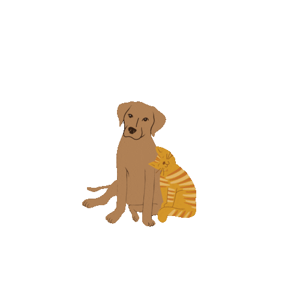

<!-- https://readme-typing-svg.demolab.com/demo/?weight=700&size=35&duration=3000&pause=500&color=36B337&background=EDEFE800&center=true&vCenter=true&repeat=false&width=800&height=100&lines=%E2%80%A7%CB%9A%CB%9A%E2%80%A7%EF%BD%A1%E2%8B%86+Hello+Hello%2C+I%27m+Melanie+%E2%8B%86%EF%BD%A1%E2%80%A7%CB%9A%CB%9A%E2%80%A7 -->

✿ I am a new CS grad from the University of Houston as of May 2026 ˚₊  ꩜  ˖ °  ♡  ⋆｡˚  ⊹ ࣪   ✦  ⟡

**⋆｡˚ Technologies I have worked with**

**♡ Reach me ˚₊**

<!-- UNIQUE-VISITORS:START -->

<!-- UNIQUE-VISITORS:END -->
